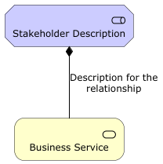
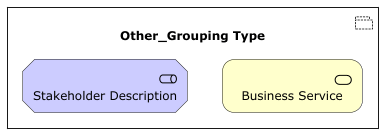
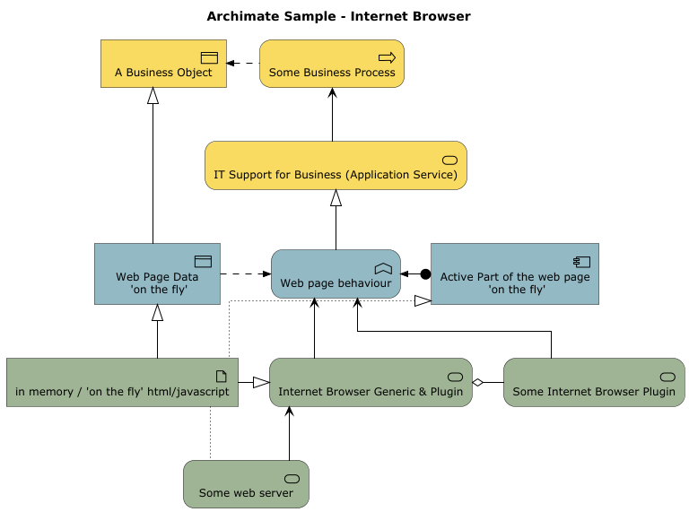
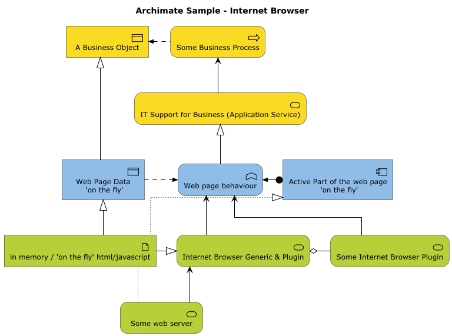

# Archimate-PlantUML

PlantUML macros and includes for creating Archimate Diagrams easily.

 

## Table of Contents
1. [Background](#background)
   - [PlantUML](#plantuml)
   - [ArchiMate](#archimate)
2. [Getting Started](#getting-started)
3. [Usage](#usage)
   - [ArchiMate Elements](#archimate-elements)
   - [ArchiMate Relationships](#archimate-relationships)
   - [ArchiMate Groups](#archimate-groups)
   - [Nesting of Components](#nesting-of-components)
   - [Theme Support](#theme-support)
4. [Example](#example)
5. [Contributing](#contributing)
6. [License](#license)
7. [Acknowledgments](#acknowledgments)

## Background

### PlantUML
[PlantUML](http://en.plantuml.com/) is an open-source project that allows you to create UML diagrams using a simple text language. It utilizes [Graphviz](https://en.wikipedia.org/wiki/Graphviz) for diagram layout, generating images in PNG, SVG, or LaTeX formats.

### ArchiMate
[ArchiMate](http://pubs.opengroup.org/architecture/archimate3-doc/) is an enterprise architecture modeling language that supports the description, analysis, and visualization of architecture across business domains.

ArchiMate offers a common language for describing the construction and operation of business processes, organizational structures, information flows, IT systems, and technical infrastructure. This is just like an architectural drawing in classical building where the architecture describes the various aspects of the construction and use of a building. This insight helps the different stakeholders to design, assess, and communicate the consequences of decisions and changes within and between these business domains. 

[Archimate-PlantUML](https://github.com/plantuml-stdlib/Archimate-PlantUML) combines the benefits of PlantUML and ArchiMate for providing a simple way of creating and managing ArchiMate diagrams. The Archimate-PlantUML is a set of macros and other includes written on top of [PlantUML Archimate specification](http://plantuml.com/archimate-diagram), with an aim to simplify the syntax for creating elements and defining relationships.

## Getting Started
Include the `Archimate.puml` file in your `.puml` or `.wsd` file. There are multiple options, depending on how current you want to be

### Using built-in support
```plantuml
' to use the built-in support
!include <archimate/Archimate>

' optionally choose one of the available themes
'!theme archimate-alternate from <archimate/themes>
'!theme archimate-handwriting from <archimate/themes>
'!theme archimate-lowsaturation from <archimate/themes>
'!theme archimate-saturated from <archimate/themes>
'!theme archimate-standard from <archimate/themes>

```

### Using a version available on the internet

You will need to:
1. download the latest version of `Archimate.puml`, including the themes folder and store them some place locally
   * `./dist/plantuml/plantuml-stdlib/stdlib/archimate/Archimate.puml`
   * `./dist/plantuml/plantuml-stdlib/stdlib/archimate/themes/` folder plus files
2. Add a `!global $ARCH_LOCAL = %true()` to your PlantUML file prior to the include statement 

```plantuml

!global $ARCH_LOCAL = %true()
!$LOCAL_FOLDER = "[path to the folder that holds Archimate.puml]"
!include $LOCAL_FOLDER/Archimate.puml

' optionally choose one of the available themes
'!theme archimate-alternate from $LOCAL_FOLDER/themes
'!theme archimate-handwriting from $LOCAL_FOLDER/themes
'!theme archimate-lowsaturation from $LOCAL_FOLDER/themes
'!theme archimate-saturated from $LOCAL_FOLDER/themes
'!theme archimate-standard from $LOCAL_FOLDER/themes
```

> [!IMPORTANT]
> Using `!include` on `https://raw.githubusercontent.com/plantuml-stdlib/Archimate-PlantUML/master/dist/plantuml-stdlib/stdlib/archimate/Archimate.puml`
> **may** not work, because that file by default relies on the built-in themes, which may not be compatible with the latest version of `Archimate.puml`
> on `master`.

## Usage
After you have included `Archimate.puml` you can use the defined macros for ArchiMate elements. 

### ArchiMate Elements
The ArchiMate elements are defined in the following pattern, with two mandatory parameters and two optional parameters:
```plantuml
Category_ElementName(nameOfTheElement, "description", $nest=%false(), $special=$ARCH_SPECIAL_SHAPES)
```

Nesting and special shapes are explained further down this page.

For example:  
* To define a `Stakeholder` element, which is part of `Motivation` category, the syntax will be
    ```plantuml
    Motivation_Stakeholder(StakeholderElement, "Stakeholder Description")
    ```
    Output:  
    
* To define a `Business Service` element,
    ```plantuml
    Business_Service(BService, "Business Service")
    ```
    Output:  
     

### ArchiMate Relationships
The ArchiMate relationships are defined with the following pattern:
```plantuml
Rel_RelationType(fromElement, toElement, "description")
```
and to define the direction / orientation of the two elements:
```plantuml
Rel_RelationType_Direction(fromElement, toElement, "description")
```
The `RelationTypes` supported are:
 - Access, Access_r, Access_rw, Access_w
 - Aggregation
 - Assignment
 - Association, Association_dir
 - Composition
 - Flow
 - Influence
 - Realization
 - Serving
 - Specialization
 - Triggering

The `Directions` supported are:
 - Up
 - Down
 - Left
 - Right

For example:
* To denote a `composition` relationship between the Stakeholder and Business Service defined above, the syntax will be
    ```plantuml
    Rel_Composition(StakeholderElement, BService, "Description for the relationship")
    ```
    Output:  
    
* To orient the two elements in left-right position, the syntax will be
    ```plantuml
    Rel_Composition_Right(StakeholderElement, BService, "Description for the relationship")
    ```
    Output:  
    

### ArchiMate Groups
Groups in ArchiMate are denoted using one of the following 3 possible ways:
```plantuml
Group(nameOfTheGroup, "Group"){
    //Define the ArchiMate Elements
}

Grouping(nameOfTheGroup, "Grouping"){
    //Define the ArchiMate Elements
}

Other_Grouping(nameOfTheGroup, "Other_Grouping Type"){
    //Define the ArchiMate Elements
}
```

For example

| Group Type     | Result                                                |
|----------------|-------------------------------------------------------|
| Group          |                   |
| Grouping       |             |
| Other_Grouping |  |

### Special shapes
By default, all shapes are rectangular (either with sharp, rounded, or beveled corners) and show a stereotype icon in the
top right. Some elements can be shown in a different shape, without the stereotype. This is controlled by setting
`$ARCH_SPECIAL_SHAPES` to `%true()` (default is `%false()`). The supported elements have an optional named parameter that allows
you to override the setting for an individual shape.

Shapes that support special shapes are:
* Business Actor(*)
* Business Role
* Business Service(*)
* Application Service(*)
* Technology Node
* Technology Artifact
* Technology Service(*)
* Motivation Stakeholder
* Motivation Meaning
* Motivation Value(*)

> [!IMPORTANT]
> Note: the special shapes marked with (*) do not support nesting other elements within them, so you need to add a 
> `$nest=%false()` parameter when using these elements with special shapes.

```plantuml
@startuml

!global $ARCH_SPECIAL_SHAPES = %true()

!include <archimate/Archimate>

Motivation_Stakeholder(MS, "Motivation Stakeholder") {
    Motivation_Stakeholder(MSI, "Inner Stakeholder", $special=%true())
    Motivation_Stakeholder(MSI2, "Another Inner Stakeholder", $special=%false())
}
Motivation_Meaning(MM, "Motivation Meaning") {
    Motivation_Meaning(MMI, "Inner Meaning", $special=%true())
    Motivation_Meaning(MMI2, "Another Inner Meaning", $special=%false())
}
Motivation_Value(MV, "Motivation Value", $nest=%true()) {
    Motivation_Value(MVI, "Inner Value", $special=%true())
    Motivation_Value(MVI2, "Another Inner Value", $special=%false())
}
Business_Actor(BA, "Business Actor", $nest=%true()) {
    Business_Actor(BAI, "Inner Actor", $special=%true())
    Business_Actor(BAI2, "Another Inner Actor", $special=%false())
}
Business_Service(BS, "Business Service", $nest=%true()) {
    Business_Service(BSI, "Inner Service", $special=%true())
    Business_Service(BSI2, "Another Inner Service", $special=%false())
}
Technology_Node(TN, "Technology Node"){
    Technology_Node(TNI, "Inner Node", $special=%true())
    Technology_Node(TNI2, "Another Inner Node", $special=%false())
}

Technology_Artifact(TA, "Technology Artifact") {
    Technology_Artifact(TAI, "Inner Artifact", $special=%true())
    Technology_Artifact(TAI2, "Another Inner Artifact", $special=%false())
}

@enduml
```

Result:


### Nesting of Components
Nesting allows grouping components hierarchically, improving diagram clarity. There are no limitations on the number of levels of nesting.
The implementation allows nesting of any components inside any other components. When nesting, the element will be displayed in its normal shape, with the archimate archetype on the top right corner.

Nesting is automatic by default, just add the nested elements between curly braces `{ ... }`:
```plantuml
Category_ElementName(nameOfTheElement, "description") {
    Category_ElementName(uniqueName, "description)
}
```

For example:
```plantuml
Business_Product("BusProduct01", "Business Product 01") {
    Business_Service("BusService01", "Business Service 01")
    Business_Service("BusService02", "Business Service 02")
    Business_Service("BusService03", "Business Service 03"){
        Business_Function("BusFunction", "Business Function")
    }
}

Technology_Node("TechDevice01", "Technology Device 01") {
    Technology_Node("TechDevice02", "Technology Device 02")
    Technology_Node("TechnDevice03", "Technology Device 03") {
        Technology_Node("TechnDevice04", "Technology Device 04")
        Technology_Node("TechnDevice05", "Technology Device 05")
    }
}

```
Output:


#### Nesting with special shapes

> [!IMPORTANT]
> As mentioned above, some elements support special shapes. However, when using special shapes, nesting is not always possible using the 
> special shape. This applies to all `Service` elements, and the `Motivation_Value` element. If you have special shapes active, you have
> to add a `$nest=%false()` parameter to these elements to avoid errors or unexpected results.

### Theme Support
Theme support is enabled and 5 variations are available. All the themes are based on Archimate specifications.

Theme can be enabled by adding the following line.
```plantuml
!theme [theme-name] from <archimate/themes>

// Example
!theme archimate-saturated from <archimate/themes>
```

| Theme Name               | Preview                                               |
|--------------------------|-------------------------------------------------------|
| Default (No line added)  |                 |
| archimate-standard       |               |
| archimate-alternate      |             |
| archimate-saturated      |             |
| archimate-lowsaturation  |    |
| archimate-handwriting    |         |

## Example
```plantuml
@startuml
!include <archimate/Archimate>
!theme archimate-standard from <archimate/themes>

title Archimate Sample - Requirement & Application Services

'Elements'
Motivation_Requirement(ReqPayrollStandard, "Do Payroll with a standard system")
Motivation_Requirement(ReqBudgetPlanning, "Do budget planning within the ERP system")

Application_Service(ASPayroll,"Payroll Service")
Application_Service(ASBudgetPlanning,"Budget Planning Service")
Application_Component(ACSAPFinanceAccRec, "SAP Finance - Accounts Recievables")
Application_Component(ACSAPHR, "SAP Human Resources")
Application_Component(ACSAPFin, "SAP Finance")
Application_Component(ACSAP,"SAP") 

'Relationships'
Rel_Realization_Up(ASPayroll, ReqPayrollStandard)
Rel_Realization_Up(ASBudgetPlanning, ReqBudgetPlanning)
Rel_Realization_Up(ACSAPFinanceAccRec, ASBudgetPlanning)
Rel_Realization_Up(ACSAPHR, ASPayroll)

Rel_Composition_Up(ACSAPFin, ACSAPFinanceAccRec)
Rel_Composition_Up(ACSAP, ACSAPHR)
Rel_Composition_Up(ACSAP, ACSAPFin)
@enduml
```

Output:  
 

## Contributing
If you have any ideas, [open an issue](https://github.com/plantuml-stdlib/Archimate-PlantUML/issues/new) or fork the repository and submit a pull request.

## License
This project is licensed under the MIT License - see the [LICENSE](LICENSE) file for details

## Acknowledgments
* [PlantUML Reference Guide](http://plantuml.com/PlantUML_Language_Reference_Guide.pdf) - PlantUML Reference Guide
* [Archimate 3.1 Specification](http://pubs.opengroup.org/architecture/archimate3-doc/) - Archimate Specifications
* [Plant UML Archimate Specifications](http://plantuml.com/archimate-diagram) - for archimate spec in PlantUML
* [C4-PlantUML](https://github.com/plantuml-stdlib/C4-PlantUML) - for inspiration, base structure and scripts idea
